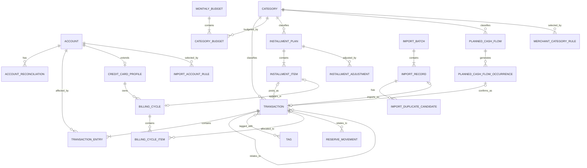

# 个人财务管理系统轻量系统设计

> 文件路径：`docs/system-design.md`  
> 文档版本：v1.1
> 文档状态：系统设计基线  
> 对应需求：`docs/requirements.md`  
> 适用范围：第一版（MVP）  
> 使用对象：单用户，仅系统所有者本人

---

## 1. 文档目的

本文档定义个人财务管理系统第一版的技术架构、模块边界、数据模型、账务计算规则、核心业务流程、账单导入机制、安全设计、备份恢复方案和云端部署方式。

本文档作为后续 Codex 任务规划、详细设计、编码、测试和部署的主要输入。

设计目标：

1. 优先保证账务计算正确；
2. 保持架构轻量，减少不必要的前后端重复；
3. 保护高敏感个人财务数据；
4. 支持低成本云端部署；
5. 保持后续迭代和数据迁移的可控性；
6. 避免微服务、复杂前端状态管理和过度领域建模。

---

## 2. 设计原则

### 2.1 核心原则

1. **账本是资金事实的唯一来源**；
2. 账户余额由账务条目计算，不直接依赖可修改余额字段；
3. 信用卡、分期、预算和导入模块不得重复维护同一笔消费事实；
4. 未来计划不提前修改当前资产和负债；
5. 所有金额使用精确十进制类型；
6. 关键写操作必须整体成功或整体失败；
7. 已进入正式业务关系的财务数据不直接破坏性删除；
8. 前端仅负责展示和交互，所有核心规则由后端执行；
9. 导入记录在用户确认前与正式账本隔离；
10. 报表和风险结果第一版以实时计算为主。

### 2.2 轻量化原则

第一版不引入：

- React 或 Vue 单页应用；
- 独立 REST API 工程；
- Redis；
- Celery；
- 消息队列；
- 微服务；
- Kubernetes；
- Repository 层；
- 完整 DDD 或六边形架构；
- AI 自动分类；
- 多用户权限体系。

---

## 3. 技术栈

| 层次 | 技术 |
|---|---|
| 开发语言 | Python 3.13 |
| Web 框架 | Django 5.2 LTS |
| 页面渲染 | Django Templates |
| 局部交互 | HTMX |
| UI | Bootstrap 5 |
| 图表 | Apache ECharts |
| 数据库 | PostgreSQL 17 |
| ORM | Django ORM |
| 应用服务器 | Gunicorn |
| 反向代理与 HTTPS | Caddy |
| 部署 | Docker Compose |
| 测试 | pytest、pytest-django |
| 代码质量 | Ruff |
| 账单解析 | Python 标准库、csv、openpyxl |
| 金额类型 | Python `Decimal`、PostgreSQL `numeric` |
| 密码哈希 | Argon2，PBKDF2 作为兼容后备 |
| 备份加密 | Scrypt + AES-256-GCM |

---

## 4. 总体架构

```text
电脑或手机浏览器
        │
        │ HTTPS
        ▼
      Caddy
  ├─ TLS 证书
  ├─ HTTP → HTTPS
  ├─ 安全响应头
  └─ 反向代理
        │
        ▼
 Django + Gunicorn
  ├─ 服务端页面渲染
  ├─ 登录与会话
  ├─ 账务业务逻辑
  ├─ 预算与风险计算
  ├─ 账单解析
  ├─ 报表
  └─ 备份与恢复入口
        │
        ▼
   PostgreSQL

维护服务
  ├─ 数据库备份
  ├─ 备份加密与轮换
  ├─ 过期会话清理
  └─ 临时文件清理
```

### 4.1 架构形式

采用：

> **服务端渲染的模块化单体应用**

特点：

- 一个 Django 项目；
- 一个 PostgreSQL 数据库；
- 多个边界清晰的 Django App；
- 页面主要由 Django Templates 渲染；
- HTMX 仅用于局部刷新；
- 不建设独立前端工程；
- 不引入跨服务网络调用。

### 4.2 HTMX 使用边界

HTMX 适用于：

- 交易表格筛选；
- 表单局部提交；
- 预算卡片刷新；
- 导入批量操作；
- 分期风险预览；
- 弹窗和局部错误显示。

原则：

```text
普通链接和表单始终可用
HTMX 只增强交互
核心账务规则始终在后端执行
```

---

## 5. Docker Compose 服务

第一版包含四个主要服务：

```text
caddy      HTTPS、反向代理、静态文件
web        Django + Gunicorn
db         PostgreSQL
backup     备份、加密、轮换与维护任务
```

### 5.1 网络

```text
edge
backend
```

- `edge`：`caddy`、`web`
- `backend`：`web`、`db`、`backup`
- `backend` 设置为内部网络
- 只有 Caddy 暴露公网端口

公网端口：

```text
80
443
SSH
```

不得暴露：

```text
5432
8000
```

---

## 6. Django App 划分

```text
apps/
├── core/           认证、系统配置、备份恢复、通用基础设施
├── accounts/       资金账户与余额核对
├── ledger/         分类、交易和账务条目
├── credit/         信用卡账期与还款分配
├── installments/   商品分期计划与期次
├── budgets/        预算、储备、固定支出和预计收入
├── imports/        账单导入、映射、分类和去重
└── analytics/      仪表盘、报表和风险分析
```

---

## 7. 模块职责

## 7.1 `core`

负责：

- 单用户认证；
- 登录失败限制；
- 会话管理；
- 修改和重置系统密码；
- 系统时区；
- 全局预警阈值；
- 加密 `.pfbackup` 业务备份与恢复；
- CSV 导出入口；
- 通用模型基类；
- 通用异常与工具；
- 健康检查；
- 备份运行记录。

主要模型：

```text
SystemPreference
LoginAttempt
BackupRun
```

`core` 不包含具体账务计算规则。

## 7.2 `accounts`

负责：

- 银行卡；
- 微信余额；
- 支付宝余额；
- 信用卡账户基础信息；
- 初始余额；
- 启用和停用；
- 排序；
- 用户实际余额核对；
- 系统余额与实际余额差异。

主要模型：

```text
Account
AccountReconciliation
```

原则：

```text
accounts 描述账户是什么
ledger 描述账户发生了什么变化
```

## 7.3 `ledger`

系统核心账本模块，负责：

- 收入；
- 支出；
- 自有账户转账；
- 信用卡消费；
- 信用卡还款的账务条目；
- 退款；
- 余额调整；
- 分类；
- 商家；
- 标签；
- 交易搜索、筛选、修正和作废。

主要模型：

```text
Category
Transaction
TransactionEntry
Merchant
Tag
TransactionTag
```

## 7.4 `credit`

负责：

- 唯一信用卡配置；
- 信用额度；
- 个人月度消费上限；
- 账单日和还款日；
- 信用卡账期；
- 已出账和未出账；
- 正式账单金额；
- 本期应还；
- 还款分配；
- 全额还款状态。

主要模型：

```text
CreditCardProfile
BillingCycle
BillingCycleItem
```

信用卡还款本身仍通过 `ledger` 创建账务交易。

## 7.5 `installments`

负责：

- 商品分期计划；
- 每期期次；
- 未来预算承诺；
- 每期实际金额；
- 提前结清；
- 退款后的手动调整；
- 分期状态。

主要模型：

```text
InstallmentPlan
InstallmentItem
InstallmentAdjustment
```

## 7.6 `budgets`

负责：

- 月度总预算；
- 分类预算；
- 储蓄目标；
- 最低安全余量；
- 累计储备资金；
- 固定支出计划；
- 预计收入计划；
- 未来现金流预测。

主要模型：

```text
MonthlyBudget
CategoryBudget
ReserveMovement
PlannedCashFlow
PlannedCashFlowOccurrence
```

`budgets` 不直接创建正式账务事实，确认计划发生时调用 `ledger.services`。

## 7.7 `imports`

负责：

- 文件上传；
- 来源和格式识别；
- 支付宝解析；
- 微信解析；
- 标准化；
- 临时导入记录；
- 账户映射；
- 分类推荐；
- 退款关联建议；
- 重复检测；
- 批量确认；
- 导入历史；
- 原始文件清理。

主要模型：

```text
ImportBatch
ImportRecord
ImportDuplicateCandidate
MerchantCategoryRule
ImportAccountRule
```

## 7.8 `analytics`

负责：

- 首页仪表盘；
- 月度收支；
- 分类支出；
- 预算执行；
- 信用卡风险；
- 分期负担；
- 未来现金流预测；
- 图表数据。

原则：

- 只读；
- 不修改正式业务数据；
- 第一版不建立持久化统计表；
- 数据量增加后再考虑缓存。

---

## 8. 模块依赖关系

```text
accounts → core

ledger → accounts, core

credit → ledger, accounts, core

installments → ledger, credit, core

budgets → ledger, installments, core

imports → ledger, accounts, core

analytics → accounts, ledger, credit, installments, budgets
```

禁止：

```text
ledger → credit
ledger → installments
ledger → budgets
ledger → imports
```

### 8.1 跨模块调用规则

每个模块对外提供：

```text
services.py     写操作
selectors.py    读查询
types.py        输入输出类型
```

禁止跨模块直接修改内部模型。

错误：

```python
TransactionEntry.objects.create(...)
```

正确：

```python
ledger.services.create_credit_card_repayment(...)
```

---

## 9. 推荐项目目录

```text
personal-finance/
├── manage.py
├── pyproject.toml
├── uv.lock
├── README.md
├── .env.example
├── .gitignore
├── compose.yaml
├── Dockerfile
├── Caddyfile
│
├── config/
│   ├── __init__.py
│   ├── urls.py
│   ├── wsgi.py
│   └── settings/
│       ├── __init__.py
│       ├── base.py
│       ├── development.py
│       ├── test.py
│       └── production.py
│
├── apps/
│   ├── core/
│   ├── accounts/
│   ├── ledger/
│   ├── credit/
│   ├── installments/
│   ├── budgets/
│   ├── imports/
│   └── analytics/
│
├── templates/
│   ├── base.html
│   ├── components/
│   ├── partials/
│   └── registration/
│
├── static/
│   ├── css/
│   ├── js/
│   └── images/
│
├── locale/
│
├── scripts/
│   ├── entrypoint.sh
│   ├── backup.sh
│   ├── restore.sh
│   ├── cleanup_imports.sh
│   └── deploy.sh
│
├── docs/
│   ├── requirements.md
│   └── system-design.md
│
└── tests/
    ├── factories/
    ├── integration/
    └── e2e/
```

单个 App 主要采用：

```text
models/
services/
selectors.py
forms.py
views.py
validators.py
constants.py
types.py
templates/
tests/
```

---

## 10. 通用数据约定

### 10.1 主键

使用 Django 默认：

```python
models.BigAutoField(primary_key=True)
```

### 10.2 金额

所有金额使用：

```python
models.DecimalField(
    max_digits=14,
    decimal_places=2,
)
```

禁止使用 `float`。

### 10.3 时间

- 数据库存储带时区时间；
- 页面按系统配置时区显示；
- 月份统一存储为该月第一天；
- 示例：`2026-07-01`。

### 10.4 删除策略

- 已有交易的账户：停用；
- 已有交易的分类：停用；
- 正式交易：作废或反向修正；
- 已出账账期：不得删除；
- 已生效分期计划：不得物理删除；
- 未确认导入批次：允许删除；
- 子记录仅在安全范围内级联删除。

---

# 11. 核心账户模型

## 11.1 `Account`

```text
Account
├── id
├── name
├── account_type
├── balance_nature
├── initial_balance
├── is_active
├── sort_order
├── opened_at
├── note
├── created_at
└── updated_at
```

`account_type`：

```text
BANK
WECHAT
ALIPAY
CREDIT_CARD
```

`balance_nature`：

```text
ASSET
LIABILITY
```

### 11.2 账户余额

```text
账户系统余额
= initial_balance
+ 所有有效 TransactionEntry.balance_delta 之和
```

符号规则：

| 账户性质 | 增加 | 减少 |
|---|---:|---:|
| 资产 | 正数 | 负数 |
| 负债 | 正数 | 负数 |

信用卡：

- 消费：正数；
- 退款：负数；
- 还款：负数。

### 11.3 `AccountReconciliation`

```text
AccountReconciliation
├── id
├── account_id
├── actual_balance
├── calculated_balance
├── difference
├── checked_at
├── note
├── adjustment_transaction_id
└── created_at
```

```text
difference
= actual_balance
- calculated_balance
```

---

# 12. 分类与账本模型

## 12.1 `Category`

```text
Category
├── id
├── name
├── category_type
├── necessity
├── default_budget
├── is_active
├── sort_order
├── created_at
└── updated_at
```

`category_type`：

```text
INCOME
EXPENSE
```

`necessity`：

```text
NECESSARY
FLEXIBLE
```

第一版使用扁平分类。

## 12.2 `Transaction`

```text
Transaction
├── id
├── transaction_type
├── status
├── amount
├── occurred_at
├── budget_month
├── category_id
├── channel
├── counterparty
├── note
├── source
├── related_transaction_id
├── is_financial_locked
├── voided_at
├── void_reason
├── created_at
└── updated_at
```

`transaction_type`：

```text
INCOME
EXPENSE
TRANSFER
REFUND
BALANCE_ADJUSTMENT
```

`status`：

```text
ACTIVE
VOID
REVERSED
```

`source`：

```text
MANUAL
IMPORT
SYSTEM
```

`channel`：

```text
BANK
WECHAT
ALIPAY
DIRECT
OTHER
```

## 12.3 `TransactionEntry`

```text
TransactionEntry
├── id
├── transaction_id
├── account_id
├── balance_delta
├── note
└── created_at
```

本系统采用：

> 交易头 + 多账户变动条目

不是完整会计复式记账，但可以保证转账、信用卡消费和还款的一致性。

---

## 13. 交易条目规则

### 13.1 收入

收到 1000 元到银行卡：

```text
Transaction
type = INCOME
amount = 1000

Entry
银行卡：+1000
```

### 13.2 普通支出

银行卡支付 50 元：

```text
Transaction
type = EXPENSE
amount = 50

Entry
银行卡：-50
```

### 13.3 信用卡消费

信用卡支付 200 元：

```text
Transaction
type = EXPENSE
amount = 200

Entry
信用卡：+200
```

### 13.4 自有账户转账

银行卡转入支付宝 500 元：

```text
Transaction
type = TRANSFER

Entry
银行卡：-500
支付宝：+500
```

### 13.5 信用卡还款

银行卡偿还信用卡 300 元：

```text
Transaction
type = TRANSFER

Entry
银行卡：-300
信用卡：-300
```

不得计入消费。

### 13.6 退款

信用卡退款 80 元：

```text
Transaction
type = REFUND
related_transaction = 原消费

Entry
信用卡：-80
```

### 13.7 余额调整

```text
Transaction
type = BALANCE_ADJUSTMENT

Entry
目标账户：±difference
```

不得计入收入或支出。

---

## 14. 交易约束

| 类型 | Entry 要求 | 分类 |
|---|---|---|
| 收入 | 1 条资产正向变动 | 收入分类 |
| 支出 | 1 条资产减少或负债增加 | 支出分类 |
| 转账 | 2 条账户变动 | 空 |
| 退款 | 原账户反向变动 | 继承原分类 |
| 余额调整 | 1 条账户变动 | 空 |

通用约束：

- `amount > 0`；
- `balance_delta != 0`；
- 有效交易至少一条 Entry；
- 作废交易不参与余额计算；
- 已锁定交易不得直接修改核心金额和账户。

### 14.1 财务锁定

以下交易锁定：

- 已关联正式信用卡账期；
- 已关联已入账分期期次；
- 已产生退款；
- 已被其他业务记录引用；
- 已用于正式账单核对。

锁定后允许修改：

- 备注；
- 标签；
- 商家名称；
- 非财务展示字段。

锁定后核心修正流程：

```text
原交易标记 REVERSED
→ 创建反向调整交易
→ 创建正确替代交易
→ 保留关联关系
```

---

# 15. 信用卡模型

## 15.1 `CreditCardProfile`

```text
CreditCardProfile
├── id
├── account_id
├── credit_limit
├── personal_monthly_limit
├── statement_day
├── due_day
├── is_active
├── created_at
└── updated_at
```

约束：

- 最多一个有效配置；
- 必须关联负债账户；
- 日期不存在时取当月最后一天。

## 15.2 `BillingCycle`

```text
BillingCycle
├── id
├── credit_card_profile_id
├── cycle_start
├── cycle_end
├── due_date
├── status
├── official_statement_amount
├── official_due_amount
├── note
├── issued_at
├── created_at
└── updated_at
```

状态：

```text
OPEN
ISSUED
PARTIALLY_PAID
PAID
OVERDUE
```

## 15.3 `BillingCycleItem`

```text
BillingCycleItem
├── id
├── billing_cycle_id
├── transaction_id
├── item_type
├── allocated_amount
├── note
└── created_at
```

类型：

```text
CHARGE
INSTALLMENT
REFUND
REPAYMENT
FEE
ADJUSTMENT
```

一笔交易可被分配到特定账期，一笔还款也可在多个账期之间分配。

---

# 16. 信用卡计算

## 16.1 当前负债

```text
信用卡当前负债
= max(信用卡账户余额, 0)
```

```text
信用卡溢缴款
= max(-信用卡账户余额, 0)
```

## 16.2 当前净资金

```text
当前净资金
= 流动资产
- 信用卡当前负债
```

## 16.3 系统计算账单金额

```text
系统计算账单金额
= 普通消费
+ 分期当期金额
+ 手续费
+ 正向调整
- 退款
- 负向调整
```

## 16.4 本期应还

存在银行正式金额时：

```text
本期应还基准
= official_due_amount
```

否则：

```text
本期应还基准
= calculated_statement_amount
```

## 16.5 本期已还

```text
本期已还金额
= 分配到该账期的 REPAYMENT 之和
```

## 16.6 本期剩余应还

```text
本期剩余应还
= max(
    本期应还基准
    - 本期已还
    - 明确冲抵该账期的退款或调整,
    0
)
```

## 16.7 已出账和未出账

```text
已出账未还
= 所有 ISSUED、PARTIALLY_PAID、OVERDUE
  账期剩余应还之和
```

```text
系统估算未出账
= max(
    信用卡当前负债
    - 已出账未还,
    0
)
```

---

# 17. 信用卡业务流程

## 17.1 普通消费

```text
用户提交消费
→ 验证金额、分类和信用卡状态
→ 创建 EXPENSE Transaction
→ 创建信用卡 Entry：+金额
→ 匹配 OPEN 账期
→ 创建 BillingCycleItem：CHARGE
```

全部在一个数据库事务中完成。

## 17.2 确认出账

```text
打开 OPEN 账期
→ 查看系统计算金额
→ 录入银行正式账单金额
→ 录入正式应还金额
→ 确认还款日
→ 检查差异
→ 标记 ISSUED
→ 锁定核心交易
```

## 17.3 信用卡还款

```text
选择资金账户
→ 输入还款金额和日期
→ 创建 TRANSFER Transaction
→ 资产 Entry：-金额
→ 信用卡 Entry：-金额
→ 分配至未还账期
→ 更新账期状态
```

默认分配顺序：

```text
逾期账期
→ 最早到期账期
→ 后续账期
```

超出账期应还的部分作为未分配还款或溢缴款。

---

# 18. 分期模型

## 18.1 设计原则

分期创建时：

- 不立即创建商品全价交易；
- 不立即增加全部信用卡负债；
- 只创建计划和未来期次。

每期实际发生时：

- 创建该期正式交易；
- 增加当期信用卡负债或减少资产；
- 将计划预算占用转换为实际消费。

## 18.2 `InstallmentPlan`

```text
InstallmentPlan
├── id
├── product_name
├── purchase_date
├── original_price
├── category_id
├── source_type
├── installment_count
├── default_installment_amount
├── first_due_month
├── total_repayment_amount
├── status
├── note
├── created_at
└── updated_at
```

`source_type`：

```text
CREDIT_CARD
PLATFORM
```

`status`：

```text
ACTIVE
COMPLETED
EARLY_SETTLED
CANCELLED
REFUND_PROCESSING
```

## 18.3 `InstallmentItem`

```text
InstallmentItem
├── id
├── plan_id
├── sequence_number
├── due_date
├── due_month
├── planned_amount
├── actual_amount
├── status
├── ledger_transaction_id
├── billing_cycle_id
├── posted_at
├── note
├── created_at
└── updated_at
```

`due_date` 是预计到期日，用于提醒和未来事项；实际付款时间由关联正式交易的 `occurred_at` 表示。`due_month` 是预算归属月份，并始终满足：

```text
due_month = due_date 所在月份的第一天
```

状态：

```text
PLANNED
POSTED
CANCELLED
WAIVED
```

## 18.4 `InstallmentAdjustment`

```text
InstallmentAdjustment
├── id
├── plan_id
├── installment_item_id
├── adjustment_type
├── amount_delta
├── effective_date
├── related_transaction_id
├── note
└── created_at
```

类型：

```text
AMOUNT_CHANGE
CANCEL_REMAINING
REFUND
EARLY_SETTLEMENT
MANUAL_CORRECTION
```

---

# 19. 分期计算与流程

## 19.1 创建计划

```text
总还款金额
= 所有期次计划金额之和
```

```text
总费用
= 总还款金额
- 商品原价
```

```text
未来消费承诺
= 所有 PLANNED 期次金额之和
```

创建流程：

```text
输入分期信息
→ 生成计划
→ 生成 N 条期次
→ 计算未来预算
→ 运行偿还能力预测
→ 展示风险
→ 用户确认保存
```

## 19.2 信用卡期次入账

```text
选择待入账期次
→ 确认实际金额
→ 创建 EXPENSE Transaction
→ 信用卡 Entry：+实际金额
→ budget_month = due_month
→ 关联账期
→ 状态改为 POSTED
```

## 19.3 平台期次支付

```text
选择待支付期次
→ 选择资产账户
→ 创建 EXPENSE Transaction
→ 资产 Entry：-实际金额
→ budget_month = due_month
→ 状态改为 POSTED
```

## 19.4 提前结清

```text
录入实际结清金额和日期
→ 创建实际结清交易
→ 取消剩余期次
→ 创建 EARLY_SETTLEMENT 调整
→ 计划状态改为 EARLY_SETTLED
→ 重新计算未来预算
```

## 19.5 分期退款

```text
选择分期计划
→ 计划进入 REFUND_PROCESSING
→ 已入账部分逐期创建实际退款
→ 未入账部分按实际账单调整未来期次
→ 创建 InstallmentAdjustment 审计记录
→ 根据剩余期次结束退款处理
```

关联和统计规则：

- `InstallmentPlan` 是退款流程的根关联对象；
- 已入账退款必须选择一个 `POSTED InstallmentItem`，其 `ledger_transaction` 是退款交易的原支出；
- 一笔 `REFUND Transaction` 只冲减一个已入账期次，分类和 `budget_month` 继承该期原支出；银行一次退款涉及多期时，由用户拆分为多笔退款交易；
- 单个已入账期次的累计退款不得超过该期实际支出金额；
- 未入账期次不创建 `REFUND Transaction`，只通过 `InstallmentAdjustment` 减少金额或将期次改为 `CANCELLED`、`WAIVED`；
- 未来义务的累计减少不得超过对应期次尚未发生的计划金额；
- `InstallmentAdjustment` 记录计划和期次调整，不取代 `Transaction` 成为实际消费或退款的统计来源；
- 系统不推断手续费是否退款、退款优先冲抵哪一期或银行冲抵已出账账期的顺序；信用卡账期只有在用户确认后才按既有退款冲抵流程处理。

`REFUND_PROCESSING` 期间允许继续录入当前流程的实际退款和期次调整，禁止新期次入账、提前结清、删除计划或启动第二个退款流程。结束时：仍有有效未来期次则回到 `ACTIVE`；已有期次发生且以后无应付款则为 `COMPLETED`；从未发生期次且全部取消则为 `CANCELLED`。

## 19.6 到期日生成和未来 30 天事项

信用卡分期：

```text
首期月份
→ 按当前 CreditCardProfile 找到 due_date 落在该首期月份的预计 BillingCycle
→ 使用预计 BillingCycle.due_date
→ 后续月份按各自预计账期生成 due_date
```

期次正式关联 `BillingCycle` 时，若仍为 `PLANNED`，在同一事务中先以正式账期 `due_date` 修正期次的 `due_date` 和 `due_month`，再完成入账并转为 `POSTED`。信用卡账单日或还款日配置修改不自动重算已有期次；新计划使用新配置，旧计划的未入账期次可由用户手动调整。

平台分期由用户输入首期具体到期日，后续期次沿用相同日号；目标月份不存在该日时取目标月份最后一天。

未来 30 天分期事项使用包含边界的日期范围：

```text
today <= due_date <= today + 30 天
```

平台分期作为独立应付款展示。尚未进入正式账单的信用卡分期显示为预计分期；已经 `POSTED` 并计入信用卡账单的期次可以标注来源，但不得再作为独立应付款累计，避免与信用卡本期应还重复计算。

---

# 20. 预算模型

## 20.1 `MonthlyBudget`

```text
MonthlyBudget
├── id
├── month
├── total_expense_budget
├── savings_target
├── minimum_safety_buffer
├── note
├── created_at
└── updated_at
```

`month` 唯一。

## 20.2 `CategoryBudget`

```text
CategoryBudget
├── id
├── monthly_budget_id
├── category_id
├── budget_amount
├── warning_threshold
└── created_at
```

唯一约束：

```text
monthly_budget + category
```

## 20.3 `ReserveMovement`

```text
ReserveMovement
├── id
├── movement_type
├── amount
├── occurred_on
├── related_transaction_id
├── note
└── created_at
```

类型：

```text
CONTRIBUTION
WITHDRAWAL
CORRECTION
```

```text
累计储备
= CONTRIBUTION
- WITHDRAWAL
± CORRECTION
```

储备资金只是流动资产的虚拟用途划分，不独立改变账户余额。

---

# 21. 固定支出与预计收入模型

统一采用计划现金流。

## 21.1 `PlannedCashFlow`

```text
PlannedCashFlow
├── id
├── name
├── direction
├── amount
├── category_id
├── default_account_id
├── reliability
├── recurrence_type
├── start_date
├── end_date
├── day_of_month
├── is_active
├── note
├── created_at
└── updated_at
```

`direction`：

```text
INCOME
EXPENSE
```

`reliability`：

```text
CERTAIN
LIKELY
UNCERTAIN
```

`recurrence_type`：

```text
ONE_TIME
MONTHLY
YEARLY
```

## 21.2 `PlannedCashFlowOccurrence`

```text
PlannedCashFlowOccurrence
├── id
├── plan_id
├── due_date
├── planned_amount
├── status
├── linked_transaction_id
├── confirmed_at
├── note
└── created_at
```

状态：

```text
PLANNED
CONFIRMED
SKIPPED
EXPIRED
```

计划确认前不得改变账户余额。

---

# 22. 收支与预算计算

## 22.1 月度实际收入

```text
月度实际收入
= 当月有效 INCOME 交易金额之和
```

不包含：

- 预计收入；
- 退款；
- 转账；
- 信用卡还款；
- 余额调整。

## 22.2 月度净消费

```text
月度净消费
= budget_month 属于该月的支出
- budget_month 属于该月的退款
```

## 22.3 分类待发生承诺

```text
分类待发生承诺
= 当月 PLANNED 分期期次
+ 当月 PLANNED 固定支出
```

## 22.4 分类预算占用

```text
分类预算占用
= 分类实际消费
+ 分类待发生承诺
```

## 22.5 月度总预算占用

```text
月度总预算占用
= 月度实际消费
+ 月度待发生承诺
+ 储蓄目标
```

```text
本月剩余可分配预算
= 月度总支出预算
- 月度实际消费
- 月度待发生承诺
- 储蓄目标
```

### 22.6 防重复规则

计划转为实际时：

```text
确认前：
实际消费 = 0
计划承诺 = 500
总占用 = 500

确认后：
实际消费 = 500
计划承诺 = 0
总占用 = 500
```

分期和固定支出必须遵守该规则。

---

# 23. 储备资金与还款能力

## 23.1 必要保护资金

```text
必要保护资金
= 还款日前剩余必要分类预算
  与已确定必要支出中的较大值
```

## 23.2 常规可还款资金

```text
常规可还款资金
= max(
    流动资产
    - 累计储备资金
    - 必要保护资金,
    0
)
```

## 23.3 最终可还款资金

```text
最终可还款资金
= max(
    流动资产
    - 必要保护资金,
    0
)
```

## 23.4 风险状态

| 状态 | 条件 |
|---|---|
| 安全 | 常规可还款资金 ≥ 本期剩余应还 |
| 需要动用储备 | 常规不足，但最终资金足够 |
| 危险 | 最终资金仍不足 |

---

# 24. 未来现金流预测

## 24.1 起始资金

常规场景：

```text
当前流动资产
- 累计储备资金
```

动用储备场景：

```text
当前流动资产
```

## 24.2 可使用收入

只使用：

```text
direction = INCOME
reliability = CERTAIN
status = PLANNED
```

## 24.3 月度预计支出

```text
月度预计支出
= max(
    月度总支出预算,
    当月已确定支出承诺
)
```

```text
当月已确定支出承诺
= 分期应付
+ 固定支出
```

当前月份只预测剩余部分：

```text
本月剩余预计支出
= max(
    月度总预算 - 本月实际消费,
    本月剩余确定支出承诺
)
```

## 24.4 月末资金

包含储蓄目标：

```text
月末预计可用资金
= 月初可用资金
+ 确定预计收入
- 预计支出
- 储蓄目标
```

暂停储蓄：

```text
月末最低还款资金
= 月初可用资金
+ 确定预计收入
- 预计支出
```

## 24.5 分级

| 状态 | 判断 |
|---|---|
| 安全 | 不动用储备且完成储蓄目标后均达到安全余量 |
| 可承担 | 不动用储备，暂停储蓄后均达到安全余量 |
| 需要动用储备 | 动用储备并暂停储蓄后均达到安全余量 |
| 高风险 | 动用储备后仍有月份低于安全余量 |

整体状态取所有月份中的最差状态。

---

# 25. 退款、核对与修正流程

## 25.1 普通退款

```text
选择原消费
→ 输入退款金额和到账账户
→ 校验累计退款
→ 创建 REFUND Transaction
→ 创建反向 Entry
→ budget_month 继承原消费
→ 冲减原分类预算
```

限制：

```text
本次退款
<= 原消费金额 - 已完成退款
```

## 25.2 信用卡退款

信用卡 Entry 为负数，立即减少信用卡总负债。

默认不自动减少已出账应还金额，除非用户确认银行已冲抵该账期。

## 25.3 余额核对

```text
录入实际余额
→ 计算系统余额
→ 保存核对快照
→ 用户选择查错或创建余额调整
```

## 25.4 已锁定交易修正

```text
原交易 REVERSED
→ 系统反向调整
→ 创建替代交易
```

---

# 26. 账单导入架构

## 26.1 总流程

```text
上传文件
→ 文件安全检查
→ 来源和格式识别
→ 平台解析器
→ 标准化
→ 账户映射
→ 分类推荐
→ 退款建议
→ 重复检测
→ ImportRecord 待确认
→ 用户处理
→ 调用 ledger.services 入账
```

导入分为：

```text
解析阶段：文件 → ImportRecord
确认阶段：ImportRecord → Transaction
```

解析阶段不修改正式账本。

---

# 27. 导入文件支持与安全

第一版支持：

```text
CSV
XLSX
ZIP（内含一个受支持文件）
```

不支持：

- `.xls`；
- 宏文件；
- PDF；
- 图片；
- 多层压缩；
- 加密压缩包；
- 可执行文件。

默认限制：

| 项目 | 默认值 |
|---|---:|
| 上传大小 | 20 MB |
| 解压总大小 | 100 MB |
| ZIP 文件数量 | 20 |
| 最大记录数 | 100000 |
| 嵌套层数 | 1 |

必须防止：

- 路径穿越；
- 符号链接；
- ZIP 炸弹；
- 文件名覆盖；
- 伪造扩展名。

原始文件正常情况下解析后立即删除，24 小时清理作为兜底。

---

# 28. 解析器设计

## 28.1 接口

```python
class BillParser(Protocol):
    source: str
    parser_name: str
    parser_version: str

    def detect(self, file) -> DetectionResult:
        ...

    def parse(self, file) -> Iterable[ParsedBillRecord]:
        ...
```

注册表：

```python
PARSER_REGISTRY = [
    AlipayBillParser(),
    WeChatBillParser(),
]
```

解析器不得：

- 创建账户；
- 创建分类；
- 创建正式交易；
- 修改预算；
- 修改信用卡账期；
- 修改账户余额。

## 28.2 平台解析结构

```text
ParsedBillRecord
├── row_number
├── external_transaction_id
├── external_order_id
├── occurred_at_raw
├── direction_raw
├── amount_raw
├── status_raw
├── business_type_raw
├── counterparty_raw
├── item_name_raw
├── payment_method_raw
├── note_raw
├── related_external_id
└── extra
```

## 28.3 标准化结构

```text
NormalizedBillRecord
├── row_number
├── source
├── external_transaction_id
├── external_order_id
├── occurred_at
├── amount
├── canonical_status
├── candidate_transaction_type
├── channel
├── normalized_counterparty
├── display_counterparty
├── normalized_payment_method
├── related_external_id
├── exact_fingerprint
├── review_flags
└── sanitized_raw_data
```

---

# 29. 导入状态与映射

## 29.1 标准交易状态

```text
COMPLETED
REFUNDED
PARTIALLY_REFUNDED
PENDING
CLOSED
FAILED
UNKNOWN
```

## 29.2 候选交易类型

```text
INCOME
EXPENSE
REFUND
TRANSFER
UNKNOWN
IGNORE
```

平台中的“转账”不得自动认定为自有账户转账。

## 29.3 账户映射优先级

```text
1. 用户精确规则
2. 用户包含规则
3. 系统常用别名
4. 来源默认账户
5. 用户手动选择
```

## 29.4 分类推荐优先级

```text
1. 商家精确匹配
2. 商家包含匹配
3. 商品名称规则
4. 平台业务类型规则
5. 用户手动选择
```

---

# 30. 重复检测

重复检测分四层。

## 30.1 文件哈希

```text
file_sha256
```

相同成功批次不重复解析。

## 30.2 外部流水号

```text
source + external_transaction_id
```

精确重复默认禁止再次入账。

## 30.3 标准指纹

```text
SHA-256(
    source
    + transaction_type
    + amount
    + occurred_at
    + counterparty
    + payment_method
    + order_id
)
```

仅标记，不自动删除。

## 30.4 与手动交易模糊匹配

候选过滤：

```text
金额相同
方向相同
时间差不超过24小时
状态有效
```

评分：

| 条件 | 分数 |
|---|---:|
| 金额相同 | 35 |
| 类型一致 | 20 |
| 账户一致 | 20 |
| 时间差≤5分钟 | 15 |
| 时间差≤1小时 | 10 |
| 同一天 | 5 |
| 商家相同 | 10 |
| 商家包含 | 6 |

阈值：

| 分数 | 结论 |
|---|---|
| 85～100 | 高度疑似重复 |
| 70～84 | 可能重复 |
| 低于70 | 不提示 |

---

# 31. 导入模型

## 31.1 `ImportBatch`

```text
ImportBatch
├── id
├── source
├── status
├── original_filename
├── file_sha256
├── temporary_file_path
├── parser_name
├── parser_version
├── uploaded_at
├── parsed_at
├── file_deleted_at
├── total_count
├── imported_count
├── ignored_count
├── failed_count
└── error_summary
```

状态：

```text
UPLOADED
PARSING
WAITING_CONFIRMATION
PARTIALLY_IMPORTED
COMPLETED
FAILED
CANCELLED
```

## 31.2 `ImportRecord`

```text
ImportRecord
├── id
├── batch_id
├── row_number
├── external_transaction_id
├── external_order_id
├── source_external_key
├── exact_fingerprint
├── occurred_at
├── candidate_transaction_type
├── amount
├── counterparty_raw
├── payment_method_raw
├── mapped_account_id
├── suggested_category_id
├── selected_category_id
├── status
├── review_flags
├── imported_transaction_id
├── sanitized_raw_data
├── error_message
└── created_at
```

状态：

```text
PENDING
DUPLICATE_SUSPECTED
READY
IMPORTED
IGNORED
FAILED
```

## 31.3 `ImportDuplicateCandidate`

```text
ImportDuplicateCandidate
├── id
├── import_record_id
├── transaction_id
├── match_kind
├── score
├── reasons
├── is_selected
└── created_at
```

类型：

```text
EXACT_EXTERNAL_ID
EXACT_FINGERPRINT
FUZZY
REFUND_CANDIDATE
```

---

# 32. 批量确认

```text
transaction.atomic()
→ select_for_update() 锁定记录
→ 重新验证状态
→ 重新执行精确去重
→ 调用 ledger.services
→ 写入 imported_transaction_id
→ 标记 IMPORTED
→ 更新批次统计
```

限制：

- 每次最多确认 500 条；
- 整批成功或整批回滚；
- 双击提交不得重复入账。

幂等保护：

- 一对一入账关联；
- 外部流水号唯一约束；
- 状态检查；
- 行锁；
- 前端按钮禁用；
- POST 后重定向。

---

# 33. 认证与会话安全

## 33.1 用户模型

使用 Django 自带认证系统，只创建一个管理员用户。

不提供：

- 注册；
- 邮箱找回；
- 手机号找回；
- 第三方登录；
- 多用户。

## 33.2 密码

```python
PASSWORD_HASHERS = [
    "django.contrib.auth.hashers.Argon2PasswordHasher",
    "django.contrib.auth.hashers.PBKDF2PasswordHasher",
]
```

要求：

- 密码不少于 12 个字符；
- 与真实支付账号密码不同；
- 修改密码后其他会话失效。

## 33.3 登录限制

```text
同一来源 IP：
15 分钟最多失败 5 次

全局：
15 分钟最多失败 20 次
```

IP 仅保存带密钥哈希。

## 33.4 会话

| 项目 | 默认 |
|---|---|
| 空闲超时 | 60 分钟 |
| 绝对上限 | 24 小时 |
| 修改密码 | 使其他会话失效 |
| 注销 | 删除当前会话 |

使用 Django 数据库会话，不引入 Redis。

---

# 34. Django 生产安全配置

生产环境至少：

```python
DEBUG = False

ALLOWED_HOSTS = ["finance.example.com"]
CSRF_TRUSTED_ORIGINS = ["https://finance.example.com"]

SESSION_COOKIE_SECURE = True
SESSION_COOKIE_HTTPONLY = True
SESSION_COOKIE_SAMESITE = "Lax"

CSRF_COOKIE_SECURE = True
CSRF_COOKIE_SAMESITE = "Lax"

SECURE_PROXY_SSL_HEADER = (
    "HTTP_X_FORWARDED_PROTO",
    "https",
)

X_FRAME_OPTIONS = "DENY"
SECURE_CONTENT_TYPE_NOSNIFF = True
```

规则：

- 所有写操作使用 POST；
- 所有表单启用 CSRF；
- 不使用 `csrf_exempt`；
- 模板保持自动转义；
- 不保存任意 HTML；
- 不对用户文本调用 `mark_safe`；
- 尽量不使用原生 SQL。

部署必须执行：

```bash
python manage.py check --deploy \
  --settings=config.settings.production
```

---

# 35. 浏览器安全策略

由 Caddy 添加：

```text
Strict-Transport-Security
Content-Security-Policy
X-Content-Type-Options
X-Frame-Options
Referrer-Policy
Permissions-Policy
```

建议 CSP：

```text
default-src 'self';
script-src 'self';
style-src 'self';
img-src 'self' data: blob:;
font-src 'self';
connect-src 'self';
frame-ancestors 'none';
base-uri 'self';
form-action 'self';
object-src 'none';
```

要求：

- Bootstrap、HTMX、ECharts 本地保存；
- 不使用公共 CDN；
- 不加载外部统计脚本；
- 不使用第三方网站分析。

---

# 36. 密钥管理

生产目录：

```text
/opt/personal-finance/
├── compose.yaml
├── Caddyfile
├── .env
├── secrets/
│   ├── django_secret_key
│   ├── database_password
│   └── backup_master_key
└── backups/
```

非敏感配置放 `.env`。

敏感值通过 Compose secrets 挂载：

```text
/run/secrets/django_secret_key
/run/secrets/database_password
/run/secrets/backup_master_key
```

权限：

```bash
chmod 700 /opt/personal-finance/secrets
chmod 600 /opt/personal-finance/secrets/*
```

禁止提交：

```text
.env
secrets/*
真实账单
生产备份
数据库转储
```

---

# 37. 文件与日志安全

## 37.1 临时文件

原始账单和恢复文件使用 tmpfs：

```yaml
tmpfs:
  - /app/runtime/imports
  - /app/runtime/restores
```

原则：

- 不进入持久卷；
- 不进入数据库备份；
- 解析或恢复后立即删除；
- 24 小时清理作为兜底。

## 37.2 日志

可以记录：

- 登录结果；
- 限制触发；
- 解析统计；
- 批量确认结果；
- 备份和恢复结果；
- 部署和迁移结果；
- 异常类型。

不得记录：

- 密码；
- Cookie；
- Session ID；
- CSRF Token；
- 完整账单行；
- 完整交易备注；
- 完整账户标识；
- 数据库连接字符串；
- 请求正文。

Docker 日志轮换：

```yaml
logging:
  driver: json-file
  options:
    max-size: "10m"
    max-file: "5"
```

---

# 38. 备份设计

备份分为两类。

## 38.1 运维数据库备份

格式：

```bash
pg_dump --format=custom
```

文件：

```text
db-YYYYMMDDTHHMMSSZ.dump.enc
```

包含：

- 全部数据库结构；
- 全部业务数据；
- 管理员密码哈希；
- 会话；
- 导入记录；
- 系统配置。

不包含：

- 原始账单临时文件；
- Git 仓库；
- Compose secrets；
- Caddy 证书卷。

## 38.2 用户业务备份

文件：

```text
personal-finance-YYYYMMDD.pfbackup
```

该文件是用户完整业务备份的唯一生产下载格式。容器内部载荷采用 JSON；第一版不提供明文 JSON 完整备份下载。CSV 仅用于查看和分析，不承担完整恢复职责。

包含：

- 账户；
- 分类；
- 交易和条目；
- 账期；
- 分期；
- 预算；
- 储备变动；
- 固定支出和预计收入；
- 导入规则；
- 非敏感设置。

不包含：

- 密码哈希；
- 会话；
- 登录尝试；
- 备份密钥；
- 临时导入记录；
- 日志。

恢复后继续使用当前管理员密码。

---

# 39. 备份加密

## 39.1 用户备份

```text
用户口令
→ Scrypt
→ 32 字节密钥
→ AES-256-GCM
```

文件结构：

```text
PFBACKUP1
├── 格式版本
├── KDF 参数
├── 随机盐
├── 随机 Nonce
└── 加密载荷
    ├── manifest.json
    └── business-data.json
```

要求：

- 每个文件新盐；
- 每个文件新 Nonce；
- 口令不保存；
- 格式版本参与认证；
- 临时明文立即删除。

## 39.2 运维备份

使用随机 256 位 `backup_master_key`。

密钥额外保存到：

- 密码管理器；
- 或离线加密介质。

备份文件和解密密钥不得只保存在同一服务器。

---

# 40. 自动备份计划

默认时区：

```text
Asia/Singapore
```

计划：

| 类型 | 时间 | 保留 |
|---|---|---:|
| 每日 | 02:30 | 7 份 |
| 每周 | 周日 03:00 | 4 份 |
| 部署前 | 每次部署前 | 部署确认后再删除 |
| 恢复前 | 每次恢复前 | 至少 7 天 |

备份元数据：

```text
BackupRun
├── backup_type
├── status
├── started_at
├── completed_at
├── file_name
├── file_size
├── sha256
├── app_version
├── schema_version
└── error_summary
```

---

# 41. 备份验证

每次备份后执行：

```text
文件存在且非空
→ 解密测试
→ 验证认证标签
→ 校验 SHA-256
→ pg_restore --list
→ 记录结果
```

定期真实恢复测试：

```text
创建临时数据库
→ 解密
→ pg_restore --exit-on-error
→ 迁移检查
→ 运行账务完整性检查
→ 核对主要数据数量
→ 删除临时数据库
```

---

# 42. 用户业务恢复流程

```text
重新输入系统密码
→ 上传 .pfbackup
→ 输入备份口令
→ 解密和认证
→ 校验格式版本
→ 校验数据结构
→ 自动备份当前数据库
→ 进入维护模式
→ transaction.atomic() 恢复
→ 运行完整性检查
→ 提交事务
→ 清除全部会话
→ 删除临时文件
→ 重新登录
```

失败时：

- 整体回滚；
- 原数据不变；
- 自动备份保留；
- 临时明文删除；
- 页面不泄露内部细节。

---

# 43. 灾难恢复

服务器或数据库完全损坏时：

```text
1. 部署兼容应用版本
2. 创建新数据库
3. 复制加密数据库备份
4. 提供对应备份密钥
5. 解密
6. pg_restore
7. 运行迁移检查
8. 运行账务完整性检查
9. 启动应用
10. 核对余额和记录数
11. 删除临时明文
```

优先恢复到新数据库，验证后再切换。

---

# 44. 账务完整性检查

实现管理命令：

```bash
python manage.py check_financial_integrity
```

检查：

1. 有效交易存在合法 Entry；
2. 各交易类型 Entry 数量正确；
3. 资产支出减少资产；
4. 信用卡消费增加负债；
5. 信用卡还款同时减少资产和负债；
6. 退款累计不超过原消费；
7. 已入账期次关联交易；
8. 未入账期次不得关联正式交易；
9. 导入记录不得重复关联正式交易；
10. 外部流水号不得重复入账；
11. 预算月份是月份第一天；
12. 只存在一个有效信用卡；
13. 不存在悬空外键；
14. 计划转实际后预算未重复占用。

运行时机：

- 恢复后；
- 部署迁移后；
- 恢复测试中；
- 用户怀疑数据异常时。

---

# 45. Compose 设计示例

```yaml
services:
  caddy:
    image: caddy:2-alpine
    restart: unless-stopped
    ports:
      - "80:80"
      - "443:443"
    volumes:
      - ./Caddyfile:/etc/caddy/Caddyfile:ro
      - caddy_data:/data
      - caddy_config:/config
      - static_data:/srv/static:ro
    networks:
      - edge

  web:
    build:
      context: .
      target: production
    restart: unless-stopped
    read_only: true
    depends_on:
      db:
        condition: service_healthy
    secrets:
      - django_secret_key
      - database_password
    tmpfs:
      - /tmp
      - /app/runtime
    volumes:
      - static_data:/app/staticfiles:ro
    networks:
      - edge
      - backend
    healthcheck:
      test:
        [
          "CMD",
          "curl",
          "-f",
          "http://localhost:8000/health/ready"
        ]
      interval: 30s
      timeout: 5s
      retries: 3

  db:
    image: postgres:17-alpine
    restart: unless-stopped
    secrets:
      - database_password
    volumes:
      - postgres_data:/var/lib/postgresql/data
    networks:
      - backend
    healthcheck:
      test: ["CMD-SHELL", "pg_isready -U finance"]
      interval: 10s
      timeout: 5s
      retries: 5

  backup:
    build:
      context: .
      target: maintenance
    restart: unless-stopped
    depends_on:
      db:
        condition: service_healthy
    secrets:
      - database_password
      - backup_master_key
    volumes:
      - ./backups:/backups
    networks:
      - backend

networks:
  edge:
  backend:
    internal: true

volumes:
  postgres_data:
  static_data:
  caddy_data:
  caddy_config:

secrets:
  django_secret_key:
    file: ./secrets/django_secret_key
  database_password:
    file: ./secrets/database_password
  backup_master_key:
    file: ./secrets/backup_master_key
```

实际部署应固定镜像版本，不长期使用漂移标签。

---

# 46. 健康检查

## 46.1 `/health/live`

仅检查 Django 进程。

返回：

```json
{"status": "ok"}
```

不访问数据库。

## 46.2 `/health/ready`

检查：

- Django 启动完成；
- 数据库可执行 `SELECT 1`；
- 关键迁移已应用。

不得返回：

- 数据库版本；
- 表名；
- 账户数量；
- 配置；
- 异常堆栈。

健康检查主要供容器内部使用，不通过 Caddy 暴露公网。

---

# 47. 生产服务器加固

要求：

- 非 root 部署用户；
- SSH 公钥认证；
- 确认公钥可用后关闭密码登录；
- 禁止 root 密码远程登录；
- 防火墙仅开放 SSH、80、443；
- 数据库端口不开放；
- 定期安装系统安全更新；
- 容器不挂载 Docker Socket；
- 不使用 `privileged: true`；
- Web 容器非 root 用户运行；
- 生产目录仅部署用户可访问；
- 开发和生产使用不同密钥；
- 真实备份不进入 Git；
- 服务器支持时可使用 Docker Rootless。

---

# 48. 首次部署流程

```text
1. 准备 Linux 服务器和域名
2. 配置 DNS
3. 创建部署用户
4. 安装 Docker 与 Compose
5. 克隆仓库
6. 创建 .env 和 secrets
7. 构建镜像
8. 启动 PostgreSQL
9. 执行数据库迁移
10. 创建唯一管理员
11. 收集静态文件
12. 启动 Web 和 Caddy
13. 运行 check --deploy
14. 验证 HTTPS
15. 创建第一份备份
16. 执行一次恢复测试
```

命令示例：

```bash
docker compose build

docker compose up -d db

docker compose run --rm web \
  python manage.py migrate

docker compose run --rm web \
  python manage.py collectstatic --noinput

docker compose run --rm web \
  python manage.py createsuperuser

docker compose up -d

docker compose exec web \
  python manage.py check --deploy \
  --settings=config.settings.production
```

生产环境不得使用 `runserver`。

---

# 49. 升级与回滚

## 49.1 升级

```text
1. 构建新版本
2. 运行测试
3. 创建部署前备份
4. 验证备份可解密
5. 进入维护模式
6. 执行迁移
7. 更新静态文件
8. 启动新版本
9. 运行健康检查
10. 运行账务完整性检查
11. 人工核对首页和信用卡账期
12. 退出维护模式
```

## 49.2 回滚

无数据库结构变化：

```text
恢复上一镜像
→ 重启 Web
```

存在不兼容迁移：

```text
停止 Web
→ 备份失败状态
→ 恢复部署前数据库备份
→ 启动上一版本
→ 运行完整性检查
```

不得假设所有 Django Migration 均可安全反向执行。

---

# 50. 性能与资源

推荐服务器：

```text
1～2 核 CPU
2 GB 内存
20 GB 以上磁盘
```

建议 Gunicorn：

```text
workers = 2
threads = 2
timeout = 60
```

第一版不做复杂 PostgreSQL 调优。

---

# 51. 测试策略

## 51.1 模块测试

各 App 内测试：

- 模型约束；
- 服务层写操作；
- 查询口径；
- 表单校验；
- 视图权限。

## 51.2 集成测试

重点流程：

```text
test_credit_card_purchase_and_repayment
test_installment_budget_projection
test_refund_flow
test_bill_import_flow
test_backup_restore
test_transaction_reversal
test_financial_integrity
```

## 51.3 高优先级测试

1. 转账总金额守恒；
2. 信用卡还款不计消费；
3. 退款正确冲减；
4. 分期计划转实际不重复占用预算；
5. 固定支出确认前后不重复占用预算；
6. 导入重复检测；
7. 批量确认双击不重复入账；
8. 未来风险分级；
9. 恢复失败整体回滚；
10. 账务完整性检查能发现异常。

## 51.4 安全测试

- 未登录无法访问财务数据；
- 连续错误登录触发限制；
- Cookie 安全属性正确；
- 公网无法访问 5432 和 8000；
- 恶意 ZIP 被拒绝；
- 原始账单及时删除；
- 日志不包含敏感数据；
- `check --deploy`无严重警告。

---

# 52. 关键数据库约束与索引

## 52.1 唯一约束

```text
最多一个有效 CreditCardProfile
MonthlyBudget.month 唯一
CategoryBudget(monthly_budget, category) 唯一
InstallmentItem(plan, sequence_number) 唯一
ImportRecord(batch, row_number) 唯一
source + external_transaction_id 唯一
InstallmentItem.ledger_transaction_id 唯一
PlannedCashFlowOccurrence.linked_transaction_id 唯一
ImportRecord.imported_transaction_id 唯一
```

## 52.2 主要索引

```text
Transaction(status, occurred_at)
Transaction(transaction_type, occurred_at)
Transaction(category, budget_month)
TransactionEntry(account, transaction)
BillingCycle(status, due_date)
InstallmentItem(status, due_month)
InstallmentItem(status, due_date)
PlannedCashFlowOccurrence(status, due_date)
ImportRecord(batch, status)
ImportRecord(external_transaction_id)
ImportRecord(exact_fingerprint)
MerchantCategoryRule(is_active, priority)
```

---

# 53. 核心实体关系图



---

# 54. 必须保持的系统不变量

1. 资产账户支出减少资产；
2. 信用卡消费增加信用卡负债；
3. 信用卡还款同时减少资产和负债；
4. 信用卡还款不计入消费；
5. 普通转账不改变流动资产总额；
6. 退款累计不超过原消费；
7. 作废交易不影响余额；
8. 已锁定交易不得直接改写核心数据；
9. 分期计划创建时不提前增加信用卡负债；
10. 分期期次转为实际后预算不得重复增加；
11. 固定支出确认后预算不得重复增加；
12. 预计收入到账前不得增加账户余额；
13. 储备资金变动不得直接改变账户余额；
14. 未确认导入记录不得进入正式账本；
15. 正式账单金额以银行确认值为准；
16. 风险预测不得使用较可能或不确定收入；
17. 金额运算不得使用二进制浮点数；
18. 导入和恢复操作必须具备数据库级幂等保护；
19. 恢复失败后原数据必须保持不变；
20. 原始账单文件不得长期保存。

---

# 55. 第一版实现优先级

## P0：必须完成

1. 项目骨架和部署基础；
2. 单用户认证；
3. 账户、分类和核心账本；
4. 收入、支出、转账、还款、退款和余额调整；
5. 信用卡账期；
6. 分期计划；
7. 预算和风险计算；
8. 仪表盘和报表；
9. 支付宝和微信账单导入；
10. 去重和人工确认；
11. 业务备份和恢复；
12. 数据库自动备份；
13. Docker Compose 云端部署；
14. 账务完整性检查。

## P1：应当完成

1. 商家分类规则；
2. 账户映射规则；
3. 交易复制和常用模板；
4. 导入信息补全现有手动交易；
5. 未来 30 天事项；
6. 会话管理；
7. 可配置安全和预算阈值。

## P2：后续增强

1. 银行卡和信用卡账单解析；
2. 浏览器通知；
3. 邮件账单解析；
4. PWA 快捷记账；
5. 对象存储异地备份；
6. 双因素认证；
7. 合规官方 API 自动同步。

---

# 56. 待开发任务阶段细化的事项

以下内容由具体任务文档确定：

- Django Model 的最终字段长度；
- 表单布局；
- 页面交互细节；
- 默认分类初始化数据；
- 支付宝和微信真实列名映射；
- 去重阈值调优；
- `check_financial_integrity`具体实现；
- 备份文件二进制头格式；
- 恢复维护模式实现；
- Caddyfile 完整配置；
- Dockerfile 多阶段构建；
- Gunicorn 启动参数；
- 自动备份调度实现；
- 服务器供应商和域名；
- CI 任务；
- E2E 测试工具。

---

# 57. 设计变更原则

后续设计调整应遵循：

1. 先更新 `docs/requirements.md` 或本文档；
2. 不破坏账务唯一事实来源；
3. 不通过新增缓存字段替代账本；
4. 不引入重复统计；
5. 不直接修改已锁定历史；
6. 不降低导入幂等性；
7. 不削弱备份恢复能力；
8. 新增负债类型必须纳入风险预测；
9. 修改交易口径必须补充测试；
10. 系统设计优先保持轻量。

---

## 58. 设计结论

第一版采用 Django 服务端渲染模块化单体架构，使用 PostgreSQL 保存正式财务数据，Caddy 提供 HTTPS，Docker Compose 统一部署。

系统以 `Transaction + TransactionEntry` 为账本核心，账户余额从账务条目计算。信用卡、分期、预算和导入模块引用账本事实，但不得重复维护账户余额和消费数据。

商品分期只在每期实际发生时进入正式账本，未来期次作为预算承诺。预算、信用卡偿还能力和未来现金流采用明确的逐月计算口径。

支付宝和微信账单通过可扩展解析器进入待确认区，经过账户映射、分类推荐、退款关联和四层去重后，才由账本服务正式入账。

生产部署只暴露 Caddy，数据库和应用服务器位于内部网络。系统使用独立密码、Argon2、HTTPS、安全 Cookie、临时文件隔离、加密备份、事务恢复和账务完整性检查保护财务数据。

该设计在满足第一版实际使用需求的同时，避免 SPA、微服务、异步队列和复杂领域架构带来的额外开发和维护成本。
