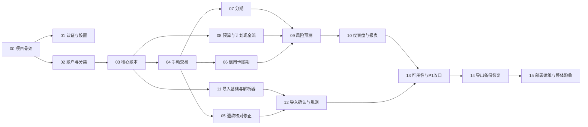
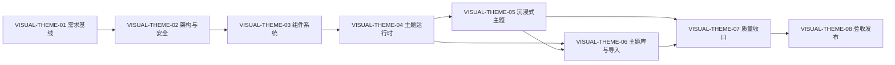

# 开发路线图

本目录严格依据 `docs/requirements.md` v1.2 与 `docs/system-design.md` v1.2 拆分。第一版任务 00～16 已完成；后续较大的功能使用“大任务名称 + 子任务编号”的命名空间继续规划和实施。

## 任务命名规则

- 第一版既有任务继续保留 `00`～`16`，不重命名历史文件和提交。
- 后续大任务使用稳定的英文大写标识和两位子任务号：`<EPIC>-<NN>`。
- 文件名使用对应的小写连字符形式：`<epic>-<nn>-<short-description>.md`。
- 示例：显示编号 `VISUAL-THEME-04`，文件名 `visual-theme-04-theme-runtime.md`。
- 子任务号表达同一大任务内的依赖顺序，不在不同大任务之间比较全局先后。
- 一个子任务仍应形成一个可审查提交；不得用大任务名扩大单次实现范围。

## 持续体验与需求输入

- [`experience_and_demand.md`](experience_and_demand.md) 持续记录系统所有者的实际体验、问题和需求。
- 该文件是后续规划输入，不替代具体任务文档；只有在系统所有者明确要求规划或实施后，才转换为有范围、依赖和验收标准的任务。
- 系统所有者临时直接提出的需求同样有效，按影响范围创建或更新对应任务后实施。

## 快速迭代模式

`QUICK-ITERATION` 用于生产基线之后的低风险、小范围修复。进入该模式必须同时满足：不改变账务或统计口径、不涉及数据迁移、不放宽安全边界、改动可独立回滚，并且能用一个轻量任务文档写清问题、范围、回归测试、人工验收、发布和回滚。

工作顺序固定为：实际证据（截图或复现）→ 根因定位 → 轻量任务文档 → 最小改动 → 窄测试与完整质量门槛 → 人工页面冒烟 → 快速生产发布与观察。符合全部准入条件时使用 `deploy/quick-upgrade.sh`，只替换 Web/Caddy 并保留备份、检查和镜像回滚；任何条件不满足时退出快速模式，改走普通任务或先更新需求/设计。

## 文档一致性检查

### 已解决的基线问题

以下问题已经由需求/设计负责人确认并写入 v1.1 基线；实现任务必须遵守结论，不得自行更改口径。

| 编号 | 原问题 | 影响任务 | 已批准结论 |
|---|---|---|---|
| B-01 | 分期期次缺少可判断未来 30 天窗口的具体日期。 | 07、10 | 新增 `due_date`，保留 `due_month` 并保持月份一致；按来源生成预计日期，未来 30 天包含起止边界，已进入信用卡账单的期次不得重复累计。 |
| B-02 | 明文 JSON 与加密 `.pfbackup` 的验收对象不明确。 | 14 | 只提供加密 `.pfbackup`，内部载荷为 JSON；不提供生产环境明文 JSON 完整备份下载。 |
| B-03 | 分期没有唯一全价原消费交易，退款关联和上限不明确。 | 07 | 以计划为根；已入账退款逐期关联原支出且一笔退款只对应一期；未入账部分只调整未来期次；Adjustment 不替代账本退款统计。 |

### 可以在具体任务中决定

| 编号 | 问题 | 处理任务 |
|---|---|---|
| D-01 | `Merchant`、`Tag`、`TransactionTag`、`SystemPreference`、`LoginAttempt`、映射规则和常用交易模板仅给出职责，未给完整字段。按已列功能设计最小字段和约束。 | 01、03、12、13 |
| D-02 | 默认分类初始化数据、字段长度、表单布局、页面交互与显示顺序未固定。使用数据迁移和最小服务端页面，并以需求清单为准。 | 02、03、各 UI 任务 |
| D-03 | 系统时区可配置但没有默认值；运维备份示例使用 `Asia/Singapore`。开发默认值和生产配置来源需固化。 | 00、01、15 |
| D-04 | 登录限流的 IP 密钥哈希细节、全局计数并发实现、会话管理页面属于任务级细化。 | 01 |
| D-05 | 账期自动创建边界、跨月账单日、正式账单差异处理和溢缴款展示细节未完全展开。 | 06 |
| D-06 | 固定支出 occurrence 的生成窗口、幂等键及跳过/过期策略未固定。 | 08 |
| D-07 | 导入真实列名、编码、平台版本样本和模糊去重文本归一化规则需由脱敏样本驱动。 | 11、12 |
| D-08 | 自动备份调度器、维护模式实现、二进制备份头、Dockerfile/Caddyfile完整内容和 CI 工具未固定。 | 14、15 |
| D-09 | “编辑/删除错误交易”与设计的锁定/反向修正需按交易是否进入正式关系分别落地。 | 04、05 |

### 暂时无需处理

- 系统设计将最低服务器建议写为 2 GB，而需求允许 1～2 GB：这是推荐配置差异，不影响正确性。
- 系统设计增加平台分期、文件 ZIP 安全限制、运维备份验证等细化，均在既有范围内，不构成范围扩大。
- P2 项目（银行卡/信用卡解析、通知、PWA、对象存储、双因素、自动同步）不进入本路线图。
- 缓存、持久化统计表和复杂 PostgreSQL 调优在单用户数据规模下暂不需要。

## 依赖关系

推荐按编号执行。01 与 02 可在 00 后并行；06、07、08 可在各自依赖满足后并行；11 可在核心账本稳定后与业务模块并行。合并前仍必须按依赖顺序集成。

## VISUAL-THEME 依赖关系

`VISUAL-THEME-01` 和 `VISUAL-THEME-02` 只固化批准后的需求与设计，不包含功能实现。后续任务严格按依赖顺序集成。

## 任务状态表

| 任务 | 名称 | 依赖 | 建议提交 | 状态 |
|---|---|---|---|---|
| [00](00-project-foundation.md) | 项目骨架与测试基础 | 无 | `chore: bootstrap django project` | 已完成 |
| [01](01-auth-and-preferences.md) | 单用户认证、会话与设置 | 00 | `feat: add single-user authentication` | 已完成 |
| [02](02-accounts-and-categories.md) | 账户、分类与初始化 | 00 | `feat: add accounts and categories` | 已完成 |
| [03](03-core-ledger.md) | 核心账本模型与原子服务 | 02 | `feat: implement core ledger` | 已完成 |
| [04](04-manual-transactions.md) | 手动交易主流程 | 01、03 | `feat: add manual transaction flows` | 已完成 |
| [05](05-refunds-reconciliation-corrections.md) | 退款、余额核对与修正 | 04 | `feat: add ledger correction flows` | 已完成 |
| [06](06-credit-card-billing.md) | 信用卡账期与还款分配 | 04 | `feat: add credit card billing` | 已完成 |
| [07](07-installments.md) | 商品分期与预算承诺 | 04 | `feat: add installment plans` | 已完成 |
| [08](08-budgets-and-planned-cashflows.md) | 预算、储备与计划现金流 | 03 | `feat: add budgets and planned cash flows` | 已完成 |
| [09](09-risk-and-forecasting.md) | 偿还能力与未来预测 | 06、07、08 | `feat: add financial risk calculations` | 已完成 |
| [10](10-dashboard-and-reports.md) | 仪表盘与统计报表 | 09 | `feat: add dashboard and reports` | 已完成 |
| [11](11-import-foundation-and-parsers.md) | 导入隔离区与平台解析器 | 03 | `feat: parse alipay and wechat bills` | 已完成 |
| [12](12-import-review-and-confirmation.md) | 映射、去重与幂等确认 | 05、11 | `feat: add bill import review flow` | 已完成 |
| [13](13-usability-and-p1-closure.md) | 模板、复制、会话和阈值收口 | 10、12 | 一组紧密相关提交 | 已完成 |
| [14](14-export-backup-and-restore.md) | CSV、业务备份与恢复 | 13 | `feat: add encrypted backup and restore` | 已完成 |
| [15](15-deployment-operations-and-acceptance.md) | Compose、自动备份、完整性与验收 | 14 | 一组运维提交 | 已完成；生产上线验收通过 |
| [16](16-production-baseline.md) | 生产上线基线固化 | 15 | `chore: freeze production baseline` | 已完成 |

### VISUAL-THEME 任务状态

| 任务 | 名称 | 依赖 | 建议提交 | 状态 |
|---|---|---|---|---|
| [VISUAL-THEME-01](visual-theme-01-requirements.md) | 视觉主题需求基线 | 16 | `docs: define visual theme requirements` | 已完成 |
| [VISUAL-THEME-02](visual-theme-02-architecture.md) | 主题架构与安全设计 | VISUAL-THEME-01 | `docs: design secure visual theme architecture` | 已完成 |
| [VISUAL-THEME-03](visual-theme-03-component-system.md) | 视觉设计系统与组件契约 | VISUAL-THEME-02 | `feat: establish themeable ui component system` | 已完成 |
| [VISUAL-THEME-04](visual-theme-04-theme-runtime.md) | 主题运行时与包格式 | VISUAL-THEME-03 | `feat: add secure theme runtime and package contract` | 已完成 |
| [VISUAL-THEME-05](visual-theme-05-immersive-default.md) | 沉浸式内置主题 | VISUAL-THEME-04 | `feat: add immersive built-in finance theme` | 已完成 |
| [VISUAL-THEME-06](visual-theme-06-theme-library.md) | 主题库、安全导入与回滚 | VISUAL-THEME-04、05 | `feat: add secure theme library management` | 已完成 |
| [VISUAL-THEME-07](visual-theme-07-quality.md) | 响应式、无障碍、动效与性能收口 | VISUAL-THEME-05、06 | `test: close visual theme quality gaps` | 已完成 |
| [VISUAL-THEME-08](visual-theme-08-acceptance.md) | 整体验收与生产发布 | VISUAL-THEME-07 | `chore: validate and release visual theme system` | 已完成；v0.2.0 生产发布验收通过 |

### QUICK-ITERATION 任务状态

| 任务 | 名称 | 依赖 | 建议提交 | 状态 |
|---|---|---|---|---|
| [QUICK-ITERATION-01](quick-iteration-01-navigation-fallback.md) | 导航重复显示修复 | v0.2.0 | `fix: prevent duplicate navigation fallback` | 已完成；生产快速发布验收通过 |

### WEALTH 任务状态

理财管理设计见 `docs/wealth-management-design.md`。

| 任务 | 名称 | 依赖 | 状态 |
|---|---|---|---|
| [WEALTH-01](WEALTH-01-foundation-accounts.md) | 理财账户基础 | v0.3.0 发布基线 | 已完成；随 `v0.3.0` 发布 |
| [WEALTH-02](WEALTH-02-transfers-income-valuation.md) | 转换、收益与估值 | WEALTH-01 | 已完成 |
| [WEALTH-03](WEALTH-03-yuebao-sync.md) | 余额宝收益率同步 | WEALTH-01 | 已完成 |
| [WEALTH-04](WEALTH-04-dashboard-acceptance.md) | 首页集成与发布验收 | WEALTH-02、03 | 已完成 |

### 生产后直接维护记录（2026-08-15）

以下为系统所有者在生产基线后直接提出的维护需求。每项均在独立 `fix/*` 分支上实现，并已通过完整质量门槛和 `deploy/upgrade.sh` 发布。详细说明见 `docs/maintenance-history.md`，逐项生产验收见 `docs/acceptance.md`。

| 日期 | 运行时提交 | 内容 | 迁移 | 状态 |
|---|---|---|---|---|
| 2026-08-15 | `e638dbc` | 页面状态中文化与组件统一；主题跨文件系统发布 | 无 | 已完成；生产发布通过 |
| 2026-08-15 | `5e0d740` | 交易表单辨识与全局间距优化 | 无 | 已完成；生产发布通过 |
| 2026-08-15 | `294c974` | 标签按收入/支出类型隔离 | `ledger.0006_tag_applies_to` | 已完成；生产发布通过 |
| 2026-08-15 | `9e14d2e` | 标签管理页面 | 无 | 已完成；生产发布通过 |
| 2026-08-15 | `5a076c8` | 分类预算批量编辑；分类删除；计划分类方向过滤 | 无 | 已完成；生产发布通过 |
| 2026-08-15 | `bb79f80` | 预算项目明细化；项目金额自动汇总总预算 | `budgets.0002_budget_item_name` | 已完成；生产发布通过 |
| 2026-08-16 | `8c1a3f5` | 计划事项自动延伸；交易项目名称；100% 阈值语义 | `ledger.0007_transaction_item_name` | 已完成；生产发布通过 |
| 2026-08-16 | `15d8ce4` | 首页可分配预算资金指标 | 无 | 已完成；生产发布通过 |
| 2026-08-16 | `fb533da` | 储蓄与消费预算拆分；月末储蓄确认结转 | `budgets.0003_savings_settlement` | 已完成；生产发布通过 |

## 每个任务的共同完成门槛

1. 任务范围和“不包含内容”均被遵守。
2. 数据迁移、服务、选择器、表单/视图和测试在同一审查单元内。
3. 所有金额使用 `Decimal`，核心写操作具有事务与约束保护。
4. 任务列出的测试通过，且未破坏已完成任务的集成测试。
5. 文档中的完成标准可由自动测试或明确的人工验收步骤证明。
