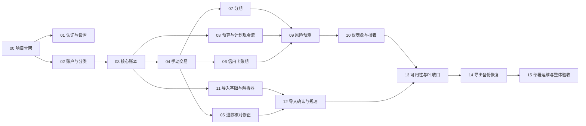

# 第一版开发路线图

本目录严格依据 `docs/requirements.md` v1.1 与 `docs/system-design.md` v1.1 拆分。计划先建立可运行骨架和账本事实，再逐层增加信用卡、预算、分期、分析、导入与运维能力。

## 文档一致性检查

### 已解决的基线问题

以下问题已经由需求/设计负责人确认并写入 v1.1 基线；实现任务必须遵守结论，不得自行更改口径。

| 编号 | 原问题 | 影响任务 | 已批准结论 |
|---|---|---|---|
| B-01 | 分期期次缺少可判断未来 30 天窗口的具体日期。 | 07、10 | 新增 `due_date`，保留 `due_month` 并保持月份一致；按来源生成预计日期，未来 30 天包含起止边界，已进入信用卡账单的期次不得重复累计。 |
| B-02 | 明文 JSON 与加密 `.pfbackup` 的验收对象不明确。 | 14 | 只提供加密 `.pfbackup`，内部载荷为 JSON；不提供生产环境明文 JSON 完整备份下载。 |
| B-03 | 分期没有唯一全价原消费交易，退款关联和上限不明确。 | 07 | 以计划为根；已入账退款逐期关联原支出且一笔退款只对应一期；未入账部分只调整未来期次；Adjustment 不替代账本退款统计。 |

### 可以在具体任务中决定

| 编号 | 问题 | 处理任务 |
|---|---|---|
| D-01 | `Merchant`、`Tag`、`TransactionTag`、`SystemPreference`、`LoginAttempt`、映射规则和常用交易模板仅给出职责，未给完整字段。按已列功能设计最小字段和约束。 | 01、03、12、13 |
| D-02 | 默认分类初始化数据、字段长度、表单布局、页面交互与显示顺序未固定。使用数据迁移和最小服务端页面，并以需求清单为准。 | 02、03、各 UI 任务 |
| D-03 | 系统时区可配置但没有默认值；运维备份示例使用 `Asia/Singapore`。开发默认值和生产配置来源需固化。 | 00、01、15 |
| D-04 | 登录限流的 IP 密钥哈希细节、全局计数并发实现、会话管理页面属于任务级细化。 | 01 |
| D-05 | 账期自动创建边界、跨月账单日、正式账单差异处理和溢缴款展示细节未完全展开。 | 06 |
| D-06 | 固定支出 occurrence 的生成窗口、幂等键及跳过/过期策略未固定。 | 08 |
| D-07 | 导入真实列名、编码、平台版本样本和模糊去重文本归一化规则需由脱敏样本驱动。 | 11、12 |
| D-08 | 自动备份调度器、维护模式实现、二进制备份头、Dockerfile/Caddyfile完整内容和 CI 工具未固定。 | 14、15 |
| D-09 | “编辑/删除错误交易”与设计的锁定/反向修正需按交易是否进入正式关系分别落地。 | 04、05 |

### 暂时无需处理

- 系统设计将最低服务器建议写为 2 GB，而需求允许 1～2 GB：这是推荐配置差异，不影响正确性。
- 系统设计增加平台分期、文件 ZIP 安全限制、运维备份验证等细化，均在既有范围内，不构成范围扩大。
- P2 项目（银行卡/信用卡解析、通知、PWA、对象存储、双因素、自动同步）不进入本路线图。
- 缓存、持久化统计表和复杂 PostgreSQL 调优在单用户数据规模下暂不需要。

## 依赖关系

推荐按编号执行。01 与 02 可在 00 后并行；06、07、08 可在各自依赖满足后并行；11 可在核心账本稳定后与业务模块并行。合并前仍必须按依赖顺序集成。

## 任务状态表

| 任务 | 名称 | 依赖 | 建议提交 | 状态 |
|---|---|---|---|---|
| [00](00-project-foundation.md) | 项目骨架与测试基础 | 无 | `chore: bootstrap django project` | 已完成 |
| [01](01-auth-and-preferences.md) | 单用户认证、会话与设置 | 00 | `feat: add single-user authentication` | 已完成 |
| [02](02-accounts-and-categories.md) | 账户、分类与初始化 | 00 | `feat: add accounts and categories` | 已完成 |
| [03](03-core-ledger.md) | 核心账本模型与原子服务 | 02 | `feat: implement core ledger` | 已完成 |
| [04](04-manual-transactions.md) | 手动交易主流程 | 01、03 | `feat: add manual transaction flows` | 已完成 |
| [05](05-refunds-reconciliation-corrections.md) | 退款、余额核对与修正 | 04 | `feat: add ledger correction flows` | 已完成 |
| [06](06-credit-card-billing.md) | 信用卡账期与还款分配 | 04 | `feat: add credit card billing` | 已完成 |
| [07](07-installments.md) | 商品分期与预算承诺 | 04 | `feat: add installment plans` | 已完成 |
| [08](08-budgets-and-planned-cashflows.md) | 预算、储备与计划现金流 | 03 | `feat: add budgets and planned cash flows` | 已完成 |
| [09](09-risk-and-forecasting.md) | 偿还能力与未来预测 | 06、07、08 | `feat: add financial risk calculations` | 已完成 |
| [10](10-dashboard-and-reports.md) | 仪表盘与统计报表 | 09 | `feat: add dashboard and reports` | 已完成 |
| [11](11-import-foundation-and-parsers.md) | 导入隔离区与平台解析器 | 03 | `feat: parse alipay and wechat bills` | 已完成 |
| [12](12-import-review-and-confirmation.md) | 映射、去重与幂等确认 | 05、11 | `feat: add bill import review flow` | 已完成 |
| [13](13-usability-and-p1-closure.md) | 模板、复制、会话和阈值收口 | 10、12 | 一组紧密相关提交 | 已完成 |
| [14](14-export-backup-and-restore.md) | CSV、业务备份与恢复 | 13 | `feat: add encrypted backup and restore` | 已完成 |
| [15](15-deployment-operations-and-acceptance.md) | Compose、自动备份、完整性与验收 | 14 | 一组运维提交 | 待开始 |

## 每个任务的共同完成门槛

1. 任务范围和“不包含内容”均被遵守。
2. 数据迁移、服务、选择器、表单/视图和测试在同一审查单元内。
3. 所有金额使用 `Decimal`，核心写操作具有事务与约束保护。
4. 任务列出的测试通过，且未破坏已完成任务的集成测试。
5. 文档中的完成标准可由自动测试或明确的人工验收步骤证明。
